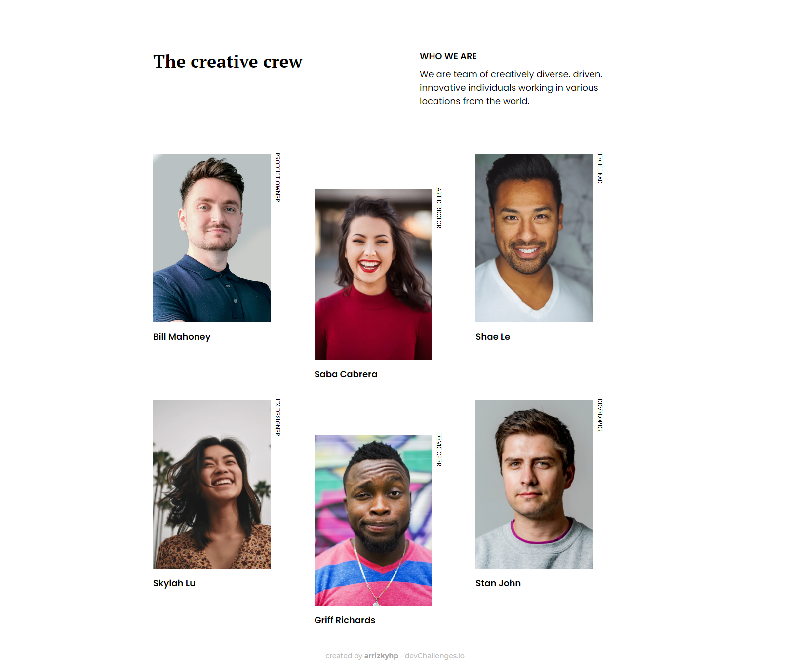

<!-- Please update value in the {}  -->

<h1 align="center">My Team Page</h1>

   Solution for a challenge from  <a href="http://devchallenges.io" target="_blank">Devchallenges.io</a>.

  <h3>
    <a href="https://arrizkyhp.github.io/dc-my-team-page/">
      Demo
    </a>
     | 
    <a href="https://devchallenges.io/solutions/NKIXriGYpBTjtMHS5U9k">
      Solution
    </a>
     | 
    <a href="https://devchallenges.io/challenges/hhmesazsqgKXrTkYkt0U">
      Challenge
    </a>
  </h3>

<!-- TABLE OF CONTENTS -->

## Table of Contents

- [Overview](#overview)
  - [Built With](#built-with)
- [Features](#features)
- [Contact](#contact)

<!-- OVERVIEW -->

## Overview

[📱 Mobile Version](./mobile.png)

### Built With

<!-- This section should list any major frameworks that you built your project using. Here are a few examples.-->

- Html
- Css

## Features

<!-- List the features of your application or follow the template. Don't share the figma file here :) -->

This application/site was created as a submission to a [DevChallenges](https://devchallenges.io/challenges) challenge. The [challenge](https://devchallenges.io/challenges/hhmesazsqgKXrTkYkt0U) was to build an application to complete the given user stories.

## Acknowledgements

<!-- This section should list any articles or add-ons/plugins that helps you to complete the project. This is optional but it will help you in the future. For exmpale -->

- [Text Rotation](https://css-tricks.com/snippets/css/text-rotation/)

## Contact

- GitHub [@arrizkyhp](https://github.com/arrizkyhp/})
- Twitter [@arrizkyhp](https://twitter.com/arrizkyhp})
